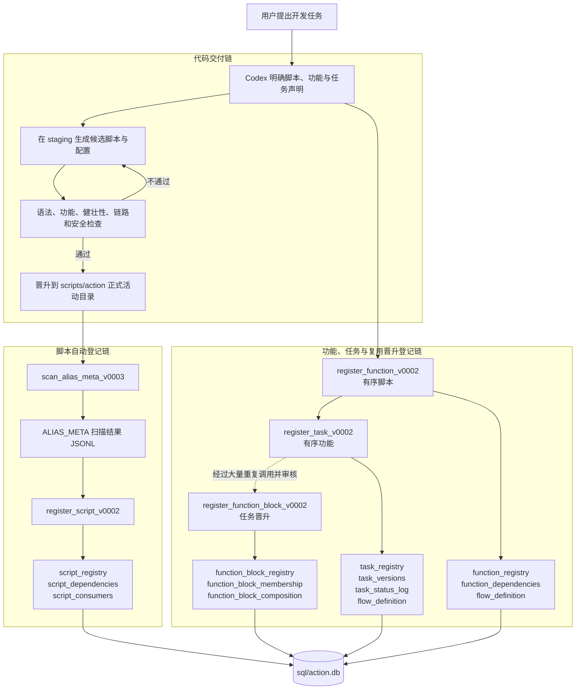
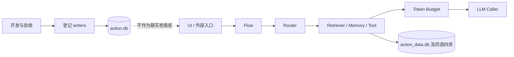

# Action 端功能开发与 `action.db` 登记规范

## 1. 文档目的

本文是未来开发、修改或扩展 Action 端功能时的活动规范。凡任务涉及 `scripts/action` 中的脚本、Action 端功能、功能块或任务登记，Codex 应先阅读本文，不再依赖用户重复说明流程。

本文固化的是两条彼此关联但职责不同的链：

1. **代码交付链**：候选文件进入 staging，经过严格检查后再晋升到正式目录；
2. **开发对象登记链**：按“脚本 → 功能 → 任务”的层级写入 `sql/action.db`；只有任务形成稳定复用价值后，才执行“任务 → 功能块”晋升。

仅检查、诊断或讨论时不得因为阅读本文而自动修改或登记。只有用户要求开发、修改、迁移或登记时，才执行对应写操作。

---

## 2. 数据库边界

### `sql/action.db`

`action.db` 是 Action 端的开发登记库，记录当前行动端的：

- 脚本及脚本依赖、消费者；
- 功能及功能依赖；
- 由高频复用任务晋升而来的功能块及其来源、成员快照和组合关系；
- 任务、任务版本和任务状态；
- 可选的流程定义。

它用于说明“系统中有什么、为什么存在、彼此如何关联”，不负责直接执行聊天、模型调用或数据检索。

### `sql/action_data.db`

`action_data.db` 属于 Action Chat 的业务数据和检索链。聊天需要查询长期数据时应连接它及同源的 Chroma、DuckDB、Neo4j，而不是查询 `action.db`。

### 运行数据

- 保存的聊天会话属于 Action Chat 的运行数据；
- 模型调用日志属于 AI adapter 的运行日志；
- API 密钥由密钥配置或环境变量提供；
- 上述内容都不应写入 `action.db` 的开发登记表。

---

## 3. 完整流程



关键原则：

- staging 检查通过后才可进入正式活动目录；
- 脚本只有进入 `scripts/action` 的有效扫描范围后，才能进入自动登记链；
- 功能和任务不是由扫描器猜测出来的，必须依据开发目标显式声明；
- 新任务不得例行登记功能块，功能块只接受带真实来源任务和复用依据的晋升；
- 启动 UI 或普通运行程序不得顺带执行开发登记；
- 未经用户授权，不得为了验收而发起可能产生费用的真实 API 调用。

---

## 4. 十三张表的职责

### 脚本表组

| 表 | 职责 |
|---|---|
| `script_registry` | 登记脚本家族、版本、入口和元数据 |
| `script_dependencies` | 登记脚本声明的依赖 |
| `script_consumers` | 登记脚本的消费者或调用方 |

### 功能表组

| 表 | 职责 |
|---|---|
| `function_registry` | 登记由有序脚本组合形成、具有明确目标的功能 |
| `function_dependencies` | 登记功能依赖的脚本、AI、第三方组件等；脚本顺序另记 Flow |
| `dependency_type_registry` | 约束功能依赖类型 |

### 功能块表组

| 表 | 职责 |
|---|---|
| `function_block_registry` | 登记由高频稳定复用任务晋升而来的功能块、来源任务和复用依据 |
| `function_block_membership` | 保存晋升时来源任务功能编排的快照 |
| `function_block_composition` | 登记功能块之间的父子或组合关系 |

### 任务表组

| 表 | 职责 |
|---|---|
| `task_registry` | 登记任务身份、目的和当前状态 |
| `task_versions` | 登记任务版本及变更摘要 |
| `task_status_log` | 记录任务状态变化 |
| `flow_definition` | 登记功能内部脚本顺序和任务内部功能顺序；不得伪造未知顺序 |

历史对象的 `flow_definition` 可以为空，但 v0002 新登记的功能和任务必须保存有序组成。`action.db` 仍是登记与关系账本，而不是运行时工作流引擎；不得仅因表存在就虚构未知流程记录。

---

## 5. 开发前必须明确的内容

开始写代码前至少确认：

1. 用户任务的目标、边界和验收标准；
2. 此次是新功能、新任务、既有对象迭代，还是具有充分证据的任务复用晋升；
3. 受影响的脚本家族、活动版本、调用方和配置；
4. 新脚本的 `ALIAS_META` 是否完整、入口是否真实；
5. 运行链中 UI、Flow、Router、Retriever、Budget、LLM Caller 的职责边界；
6. 是否会触及真实数据库、API 密钥、外部服务或付费调用；
7. 修改前行为、回退来源和测试基线。

小修复不应重复创建新的功能或任务。只有概念、职责或对外能力确实新增时，才新增对应登记对象；功能块还必须额外满足任务已经高频稳定复用的晋升条件。

### 单一脚本单一完整功能原则

从本文生效后的新开发和后续版本迭代开始，一个脚本原则上只负责一项单一而完整的功能。这里的“单一功能”是指脚本能够完成一次边界明确的输入、处理和输出闭环，其当前精细粒度锚定在**数据级**，而不是二进制级或更低维度。严禁以“单一功能”为名无限下探并把实现机械拆成大量极其琐碎、不能独立形成输入输出闭环的脚本；只有当原脚本确实能够拆分为若干个各自具有完整输入、处理和输出的独立功能时，才允许继续拆分。前端开发同样遵循此原则，各个单一功能可通过 Flow 或其他明确的流程编排组合成完整产品；如果受前端框架、构建方式或运行环境等客观条件限制而必须保留在同一脚本中，则必须在该脚本内部清晰划定各功能的职责、输入输出和调用边界。本文不授权为落实本原则而回查、拆分或修改既有脚本；既有实现只在用户另行要求修改，或其后续版本迭代本身进入任务范围时适用本原则。

---

## 6. staging、检查与晋升

### 候选区

- 新脚本或实质性修改先写入任务对应的 `staging` 子目录；
- 新配置或配置升级也先进入候选区；
- staging 中的目录结构应足以看出候选文件最终归属；
- 不用 `final`、`fixed`、`new` 等模糊后缀代替正式版本号。

### 严格检查

按风险执行并保存证据：

1. 精确 diff，确认只修改任务需要的部分；
2. 语法检查和模块导入检查；
3. 目标函数最小测试；
4. 正常路径、错误路径和边界条件测试；
5. 与上一活动版本的功能完整性对比；
6. 调用链、配置路径和相对路径检查；
7. 增量、幂等或重复执行行为检查；
8. 数据、密钥、日志和错误信息安全检查；
9. 必要的集成测试，但不得污染真实数据。

### 晋升

只有检查通过后才能：

1. 将旧活动版本按既有规则保留或归档；
2. 将新版本放入 `scripts/action` 的正式位置；
3. 将相应配置放入正式配置位置；
4. 再执行登记链；
5. 登记后复检正式文件与数据库关系。

---

## 7. 脚本自动登记顺序

扫描器的活动范围由其配置决定，当前原则是限定在 `scripts/action`，并排除 `archive`、`software` 等非活动脚本目录。范围以实际配置复核结果为准，不得只凭记忆判断。

先预检：

```powershell
.\.venv\Scripts\python.exe scripts\action\infrastructures\scan_alias_meta_v0003.py --dry-run
.\.venv\Scripts\python.exe scripts\action\infrastructures\register_script_v0002.py --dry-run --by Codex --reason "登记前复核"
```

预检通过后再正式执行：

```powershell
.\.venv\Scripts\python.exe scripts\action\infrastructures\scan_alias_meta_v0003.py
.\.venv\Scripts\python.exe scripts\action\infrastructures\register_script_v0002.py --by Codex --reason "登记已验收的 Action 脚本"
```

执行时必须核对：

- 扫描根目录和排除目录符合本次目标；
- 扫描错误数为零；
- JSONL 是本次扫描生成的预期文件；
- 没有把 archive、staging、软件启动器或敏感配置误登记；
- `script_registry`、`script_dependencies`、`script_consumers` 的关系符合 `ALIAS_META`；
- 未识别字段要明确报告，不得把警告伪装成完整成功。

`register_script_v0002` 的脚本主记录采用幂等写入。已存在的同家族同版本记录不会自然等价于“元数据已被更新”。如果入口、职责、依赖语义或行为发生实质变化，原则上应升级版本；若确需保持版本号，必须做有审计证据的定向校正并复核，不得假定重复登记会覆盖原记录。

---

## 8. 功能、任务和功能块登记顺序

推荐顺序为：

1. 先登记并验证脚本；
2. 使用真实脚本 alias 和明确顺序登记功能；
3. 使用真实 function_id 和明确顺序登记任务；
4. 日常开发到此结束，不创建功能块；
5. 只有任务经过大量重复调用并经审核形成稳定复用价值后，才携带真实 task_id 和复用依据晋升功能块；
6. 查询十三张表，核对身份、版本、Flow、来源任务和依赖关系。

每个 writer 都应先使用 `--dry-run` 验证。常用接口形态如下，实际参数以脚本 CLI 为准：

```powershell
# 功能
.\.venv\Scripts\python.exe scripts\action\infrastructures\register_function_v0002.py --name "功能名称" --description "功能说明" --scripts "脚本家族A,脚本家族B" --by Codex --reason "开发登记" --dry-run

# 任务；functions 使用前一步产生的真实 function_id，并按顺序排列
.\.venv\Scripts\python.exe scripts\action\infrastructures\register_task_v0002.py --name "任务名称" --purpose "任务目的" --functions "function_id_A,function_id_B" --version "v0001" --change-summary "首次登记" --by Codex --reason "开发登记" --dry-run

# 功能块晋升；不是每次开发的必经步骤，必须提供复用依据
.\.venv\Scripts\python.exe scripts\action\infrastructures\register_function_block_v0002.py --name "功能块名称" --description "功能块说明" --source-task "真实 task_id" --reuse-evidence "经审核的重复调用与稳定复用依据" --by Codex --reason "任务复用晋升" --dry-run
```

人工确认 dry-run 输出后，使用完全相同的声明去掉 `--dry-run` 才能写库。不得凭空编造 ID，也不得把脚本文件名直接当成任务或功能 ID。

---

## 9. 开发登记与运行时的隔离



必须保持以下隔离：

- 双击启动 UI 只启动运行程序，不自动扫描或登记；
- 启动前检查不得自动发送模型请求；
- 模型切换和 Provider 选择属于运行会话事件，不属于脚本登记；
- 聊天正文、会话保存和模型调用日志不进入 `action.db`；
- 配置文件不是可执行脚本，不登记到 `script_registry`；
- 登记 writer 由开发或维护流程显式调用，不由普通用户聊天触发。

---

## 10. 登记后的验收清单

每次完成 Action 端功能开发后逐项确认：

- [ ] 正式脚本和配置来自已通过检查的 staging 候选；
- [ ] 活动版本、入口和调用方均已复核；
- [ ] 扫描范围仅覆盖预期的 `scripts/action` 活动目录；
- [ ] ALIAS_META 扫描无解析错误；
- [ ] 脚本三表中存在正确版本及依赖关系；
- [ ] 功能和任务没有被重复或错误创建；
- [ ] 新任务没有被例行创建成功能块；
- [ ] 功能块具有真实来源任务、复用依据，成员快照引用真实 `function_id`；
- [ ] 任务版本和状态日志与此次开发事实一致；
- [ ] 没有把 `action.db` 接入聊天检索链；
- [ ] 没有泄露或登记 API 密钥；
- [ ] 未授权时没有发生付费 API 调用；
- [ ] 真实入口完成必要的集成和错误路径测试；
- [ ] 完成报告说明文件、测试、数据库结果、风险和回退方式。

---

## 11. 回退原则

- 代码优先使用 Git 或明确保留的上一活动版本回退；
- 配置与代码分别维护，回退时核对二者兼容性；
- 不使用破坏性命令清除用户已有修改；
- 登记库以追加和幂等为主，不因一次回退随意删除历史记录；
- 若登记内容确需校正，先备份并执行定向、可审计、可逆的修改；
- 运行数据和 `action_data.db` 不得因开发登记回退而被清空或重建；
- 回退后重新执行入口、链路和数据库关系复检。

---

## 12. 当前限制与解释

- 自动扫描只负责配置范围内可识别的 Action 脚本，不负责替代功能、任务和功能块晋升的人工语义声明；
- 归档脚本不属于当前活动登记范围；
- 当前模型记录脚本家族和版本，但不额外构造完整的逐次版本事件与来源追溯模型；
- `flow_definition` 只有在真实流程需要持久化时才登记，空表不是链路故障；
- 仓库中可能保留旧 capability schema 相关脚本，但当前十三张规范表构成实际 `action.db` 的活动登记模型；
- 发现非阻断性扩展需求时先记录，不得借登记任务扩张为底座重构。

本文描述的是以后每次 Action 端开发应重复执行的标准闭环：**声明目标 → staging 开发 → 严格验收 → 正式晋升 → 脚本扫描登记 → 功能登记 → 任务登记 → 数据库复核 → 完成报告与可回退证据**。功能块不是每次开发的必经步骤，只在既有任务获得充分复用证据后单独执行晋升。
